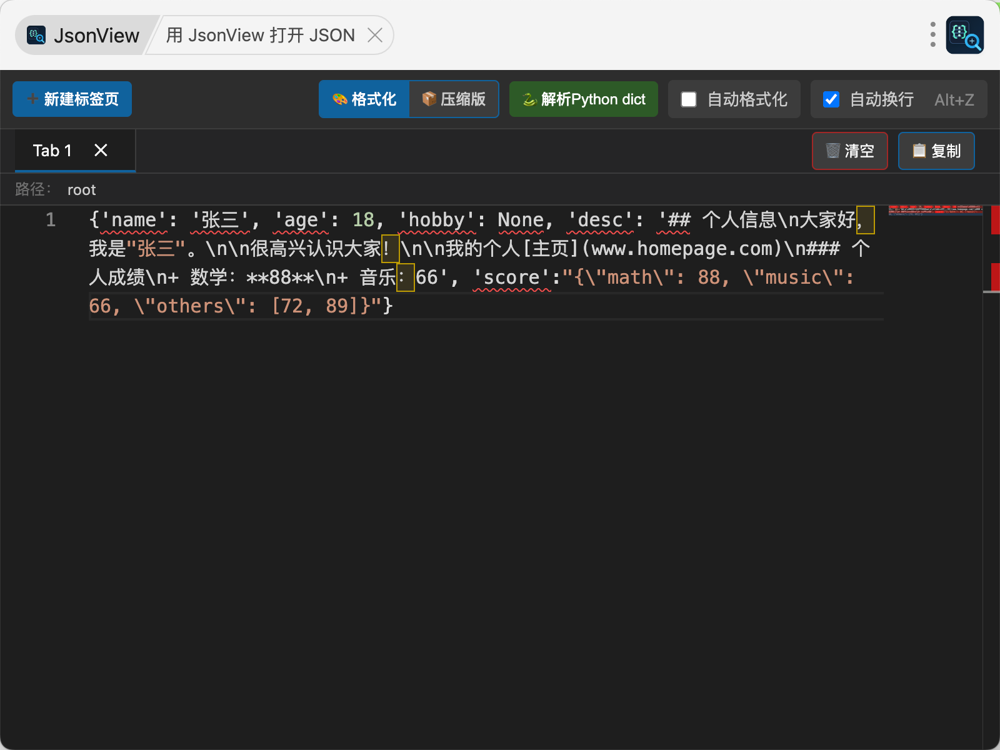
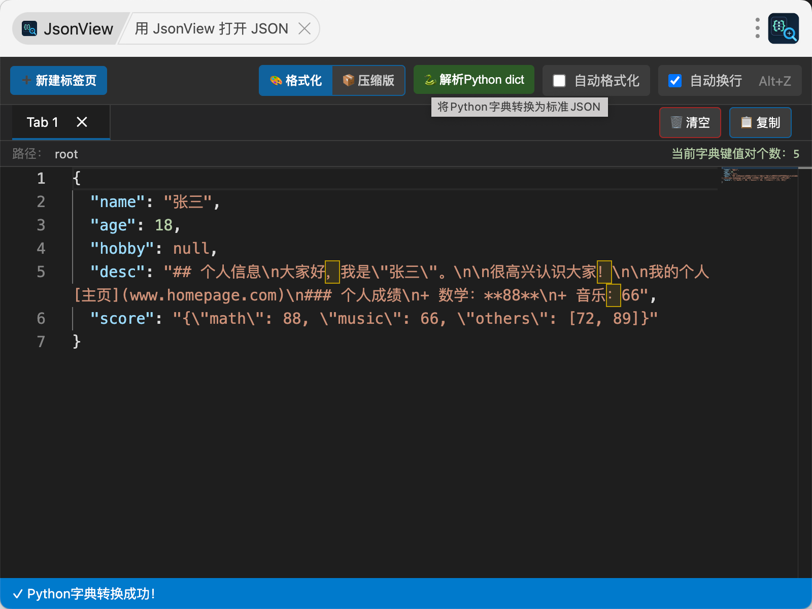
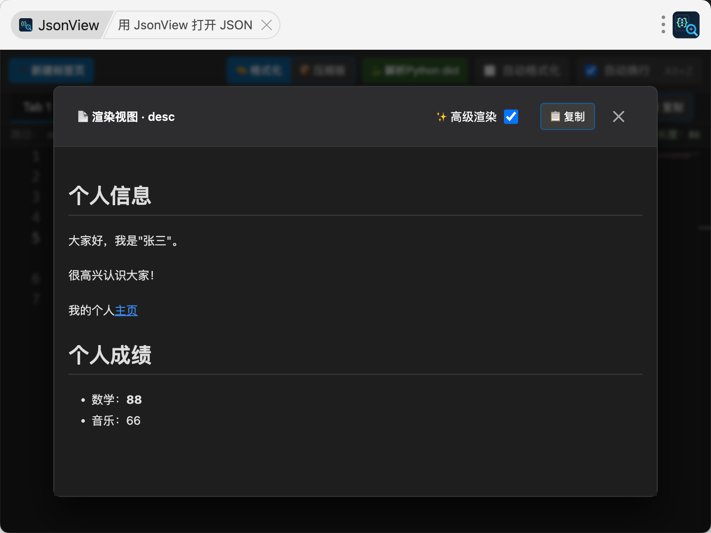
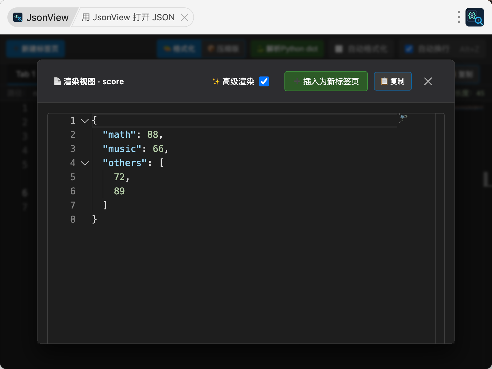
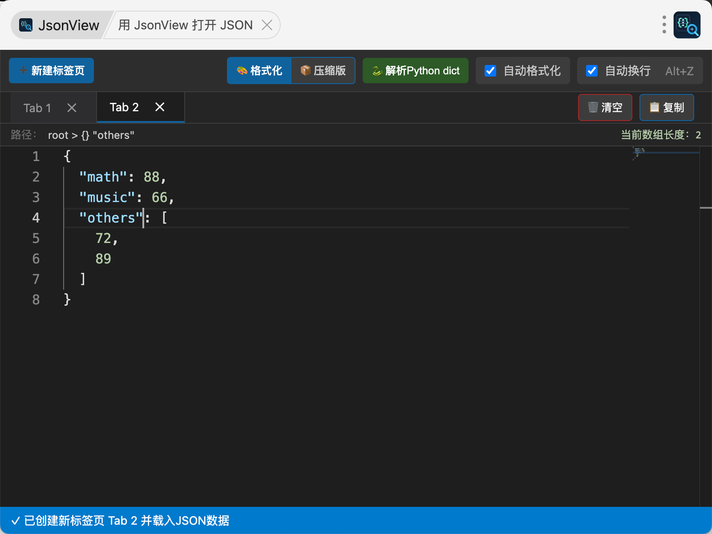

# 🛠️ 工具集 (Tools Collection)

<div align="center">

🌟 **一个收集实用开发工具的仓库，帮助开发者提高效率！**

</div>

---

## 📋 简介

欢迎来到 **工具集** 仓库！这里汇聚了各种实用的开发工具，旨在简化日常开发任务，提升工作效率。无论是前端开发、数据处理还是其他领域，我们都致力于提供高质量、易用的工具。

目前仓库包含以下工具：

### 🔧 可用工具

| 工具名称                                                         | 描述                                                       | 状态    |
| ---------------------------------------------------------------- | ---------------------------------------------------------- | ------- |
| [JsonViewer](https://xkkevin.github.io/tools/jsonviewer/index.html) | 专为JSON数据分析师设计的强大查看器，支持多种格式解析和渲染 | ✅ 可用 |

---

## 🧰 JsonViewer

### 🎯 设计理念

作为一名JSON数据分析师，您经常需要处理各种复杂的JSON数据：

- **压缩版JSON**：单行JSONL格式
- **Python dict格式**：使用单引号的字典格式
- **嵌套长文本**：包含Markdown或JSON字符串的字段

JsonViewer 专为这些场景打造，提供直观的编辑、渲染和辅助视图，帮助您高效review和分析JSON数据。

### ✨ 核心功能

#### 📝 编辑视图

- **智能解析**：自动识别并转换Python dict格式为标准JSON
- **实时编辑**：直接在视图中编辑JSON内容，实时渲染
- **多标签页**：支持同时处理多个JSON数据，每个标签独立
- **拖拽排序**：可拖拽调整标签页顺序
- **Monaco Editor集成**：使用Monaco Editor提供专业语法高亮
- **格式化/压缩切换**：一键切换格式化视图和压缩JSONL视图
- **字体大小控制**：可调节字体大小，适应不同屏幕
- **高级渲染开关**：

  - ✅ **开启**：JSON数据高亮显示，Markdown内容渲染为HTML
  - ❌ **关闭**：纯文本显示，不进行额外渲染

#### 🔍 长文本辅助视图

- **双击触发**：双击JSON中的key-value对，弹出悬浮窗显示长文本
- **智能渲染**：
  - **Markdown内容**：自动识别并渲染为HTML格式
  - **嵌套JSON**：解析并格式化显示嵌套的JSON字符串
  - **纯文本**：保留原始换行和格式
- **交互友好**：悬浮窗右上角可关闭，内容可滚动查看

#### 面包屑路径
- 支持面包屑（Breadcrumb）路径导航
- 支持字符串、字典键值对、数组长度统计

#### ⚙️ 实用工具

- **自动换行开关**：控制是否在行内换行显示长value
- **快捷键支持**：
  - **Windows**: `Alt + Z` 切换自动换行
  - **Mac**: `Option + Z` 切换自动换行
- **复制按钮**：每个文本框右上角提供一键复制功能
- **清空按钮**：编辑视图中可一键清空当前标签内容

### 🚀 如何使用

1. **获取工具**：

   ```bash
   git clone https://github.com/xkKevin/tools.git
   cd tools
   ```
2. **启动工具**：

   - 在浏览器中直接打开 `jsonviewer.html`
   - 或使用本地服务器运行以获得最佳体验
3. **基本操作**：

   - **输入数据**：粘贴JSON或Python dict格式数据
   - **查看渲染**：自动格式化并高亮显示
   - **切换模式**：使用格式化/压缩开关调整显示方式
   - **分析长文本**：双击感兴趣的字段查看详细内容
4. **高级用法**：

   - **多文档处理**：新建标签页处理不同JSON
   - **Markdown预览**：双击包含MD的字段查看渲染效果
   - **嵌套JSON解析**：双击JSON字符串字段查看结构化显示

### 📸 功能演示







### 🔧 技术栈

- **前端框架**：纯HTML/CSS/JavaScript
- **代码编辑器**：Monaco Editor (VS Code同款)
- **拖拽功能**：SortableJS
- **Markdown渲染**：Marked.js
- **主题**：深色主题，护眼设计

### 🎨 界面特色

- 🌙 **深色主题**：采用现代深色UI，减少眼部疲劳
- 📱 **响应式设计**：适配不同屏幕尺寸
- ⚡ **高性能**：本地运行，无需网络依赖
- 🎯 **直观交互**：简洁的工具栏和操作按钮
